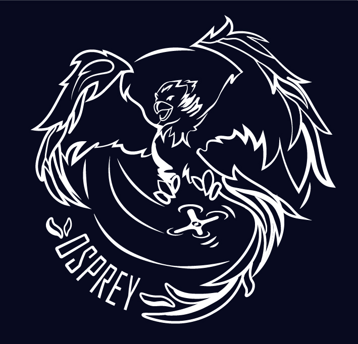

# Project Osprey
#### Daniel Connolly and William Fairman

A Fall 2020 Project

</img>

This logo is a modified version of work done by <a href="https://hweishin.carbonmade.com/">Hwei-Shin Harriman</a>, a fellow Olin student.

### Overview

We are developing a flight computer and drone as an exploration in electrical and mechanical design as well as firmware implementation.

### Subsystems

#### Electrical

Our flight computer is centered around the STM32F427VIT6 microcontroller. We have selected an IMU, barometer, GPS, and magnetometer to capture all of the necessary sensor data during flight. In addition, our board is equipped with a raspberry pi zero to which we intend to connect a small camera; the raspi communicates with the STM32 via I2C. We are also including a variety of connectors in order to ensure we can connect a remote controller and any other necessary telemetry modules. Finally, we have created a power management system based around a TI buck converter that steps down the battery voltage (12-25V) to 5V which powers several auxiliary components; three linear regulators step that voltage down further to the 3.3V required by the STM and several of the other sensors and ICs on the board.

#### Mechanical

We are creating a 3-D printable chassis for our drone in AutoDesk's Fusion 360. At the moment, we are experimenting with Fusion 360's generative design features and how well these designs perform when 3-D printed as well as creating the basic chassis layout.

#### Firmware / Software

While we have not yet begun firmware / software development, we intend to start once we have shipped version 1 of our PCB. We expect to work in C++/C while developing for the STM32 as well as Python as we develop software on the raspberry pi.

### Goals

Our overarching goal for this project is to develop a drone capable of autonomous or semi-autonomous flight. In pursuit of this goal, we hope to advance our skills in the following areas:

1. Electrical design & PCB layout: This entails selecting the mcu, sensors, power management systems, and all supporting hardware as well as continuing to develop our KiCad knowledge.

2. Firmware development: We intend to learn C++ and advance our knowledge of firmware.

3. Computer vision: We have equipped our system with a raspberry pi with the intention of connecting a camera for basic computer vision processing.

4. Mechanical design: Taking high-level constraints about lift and drone layout into consideration, we intend to extend our CAD abilities.
